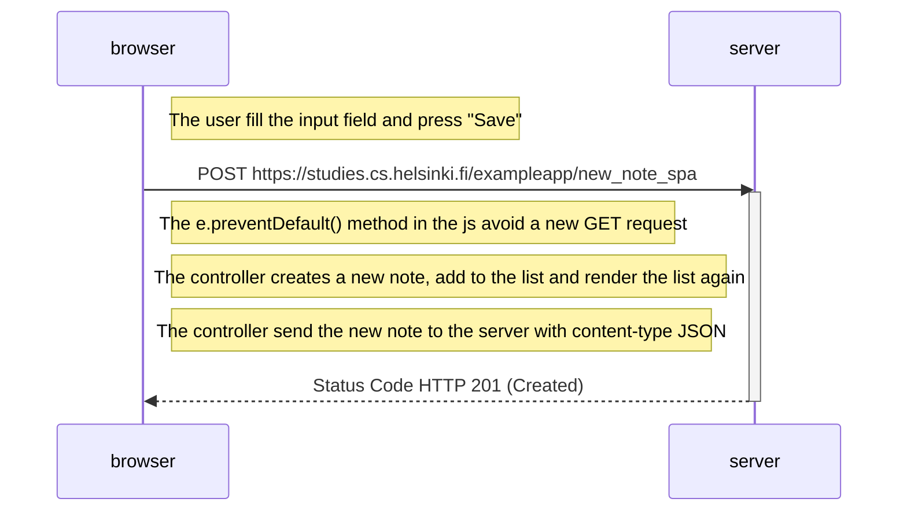

## Exercise 0.6 - New note on single page application diagram

```mermaid
sequenceDiagram
    participant browser
    participant server

    Note right of browser: The user fill the input field and press "Save"

    browser->>server: POST https://studies.cs.helsinki.fi/exampleapp/new_note_spa
    activate server

    Note right of browser: The e.preventDefault() method in the js avoid a new GET request

    Note right of browser: The controller creates a new note, add to the list and render the list again
    
    Note right of browser: The controller send the new note to the server with content-type JSON

    server-->>browser: Status Code HTTP 201 (Created)
    deactivate server
```
